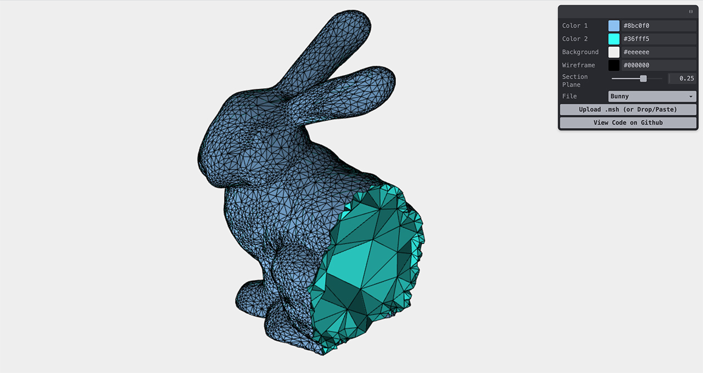

# msh-parser
[](https://apps.amandaghassaei.com/msh-parser/demo/)

[](https://www.npmjs.com/package/msh-parser)
[](https://bundlephobia.com/result?p=msh-parser)
[](https://www.npmtrends.com/msh-parser)
[](https://github.com/amandaghassaei/msh-parser/blob/main/LICENSE)

Finite element .msh format parser, written in TypeScript.

Live demo: [apps.amandaghassaei.com/msh-parser/demo/](https://apps.amandaghassaei.com/msh-parser/demo/)


## .msh File Format

The MSH file format is used for storing 3D finite element mesh information for simulation purposes.  You can generate tetrahedral .msh files from boundary meshes (.stl, .obj) using [TetWild](https://wildmeshing.github.io/tetwild/).  You can view .msh files with [Gmsh](https://gmsh.info/) or by dragging them into the [demo app](https://apps.amandaghassaei.com/msh-parser/demo/).  Example .msh files can be found in [test/msh/](https://github.com/amandaghassaei/msh-parser/tree/main/test/msh).


## Installation

### Install via npm

```sh
npm install msh-parser
```

and import into your project:

```js
import { MSHParser } from 'msh-parser';
```

### Import into HTML

Import [msh-parser.js](https://github.com/amandaghassaei/msh-parser/blob/main/dist/msh-parser.js) directly into your html:

```html
<html>
  <head>
    <script src="msh-parser.js"></script>
  </head>
  <body>
  </body>
</html>
```

`MSHParserLib` will be accessible globally:

```js
const { MSHParser } = MSHParserLib;
```


## Use

```js
// Create a new parser instance,
const parser = new MSHParser();
// Parse the .msh file using the specified file path.
parser.parse('./bunny.msh', (mesh) => {
  const {
    nodesArray,
    elementsArray,
    isTetMesh,
    exteriorFacesArray,
    numExteriorNodes,
  } = mesh;
});

// Also try:
// const mesh = await parser.parseAsync('./bunny.msh');
// Nodejs only:
// const mesh = parser.parseSync('./bunny.msh');
```

- `nodesArray` is a Float32Array or Float64Array of length 3 * numNodes containing a flat list of node positions in the following order `[x0, y0, z0, x1, y1, z1, ...]`.
- `elementsArray` is a 2 dimensional array of node indices corresponding to the finite elements of the mesh.  For a tetrahedral mesh, all elements will contain four node indices, but element length may vary for other types of meshes.  `elementsArray` has the following structure:
```js
[
  [e0a, e0b, e0c, e0d], // Element 0
  [e1a, e1b, e1c, e1d], // Element 1
  ...
]
```
- `isTetMesh` is a boolean that indicates all mesh elements are tetrahedra.
- `exteriorFacesArray` (tet-meshes only for now) is a 2 dimensional array of node indices corresponding to the exterior faces of the mesh.  For a tetrahedral mesh, all exterior faces will be triangles, but face shape may vary for other types of meshes.  Triangular exterior faces have CC winding order.  `exteriorFacesArray` has the following structure:
```js
[
  [f0a, f0b, f0c], // Face 0
  [f1a, f1b, f1c], // Face 1
  ...
]
```
- `numExteriorNodes` (tet-meshes only for now) is the number of nodes that lie on the exterior of the mesh.  `nodesArray` has been ordered so that the nodes in the range [0, numExteriorNodes - 1] correspond to the nodes referenced by `exteriorFacesArray`.

msh-parser also contains helper functions for analyzing the mesh data:

- `MSHParser.calculateEdges(mesh)` returns a Uint32Array containing all pairs of edges in the mesh.  Node indices are in the form: [e01, e02, e11, e12, ...].  This function is only implemented for tet-meshes at the moment.
- `MSHParser.calculateElementVolumes(mesh)` returns a Float32Array containing the volume of all elements in the mesh.  This function is only implemented for tet-meshes at the moment.


## Limitations

- This package has only been tested on binary tetrahedral meshes generated by [TetWild](https://wildmeshing.github.io/tetwild/) with double precision.  If you are having trouble parsing a .msh with this library, please submit an issue and attach a sample file for testing or submit a pull request with a fix.
- This package does not currently parse field data or tags, though it could be added by implementing more of the following class: [https://github.com/PyMesh/PyMesh/blob/main/src/IO/MshLoader.cpp](https://github.com/PyMesh/PyMesh/blob/main/src/IO/MshLoader.cpp).  Pull requests welcome.


## Acknowledgements

- This is a TypeScript port of the .msh parser from [PyMesh](https://github.com/PyMesh/PyMesh) by Qingnan Zhou
- Some code snippet contributions by [ChatGPT](https://chat.openai.com/chat)


## License

This work is licensed under an [MIT License](https://github.com/amandaghassaei/msh-parser/blob/main/LICENSE.txt).

## Development

I don't have any plans to continue developing this package, but I'm happy to review pull requests if you would like to add a new feature.

To install dev dependencies:

```sh
npm install
```

To compile `src` to `dist`:

```sh
npm run build
```

### Testing

To run tests:

```sh
npm run test
```


### TODO:

Test with sample files from https://people.sc.fsu.edu/~jburkardt/data/msh/msh.html